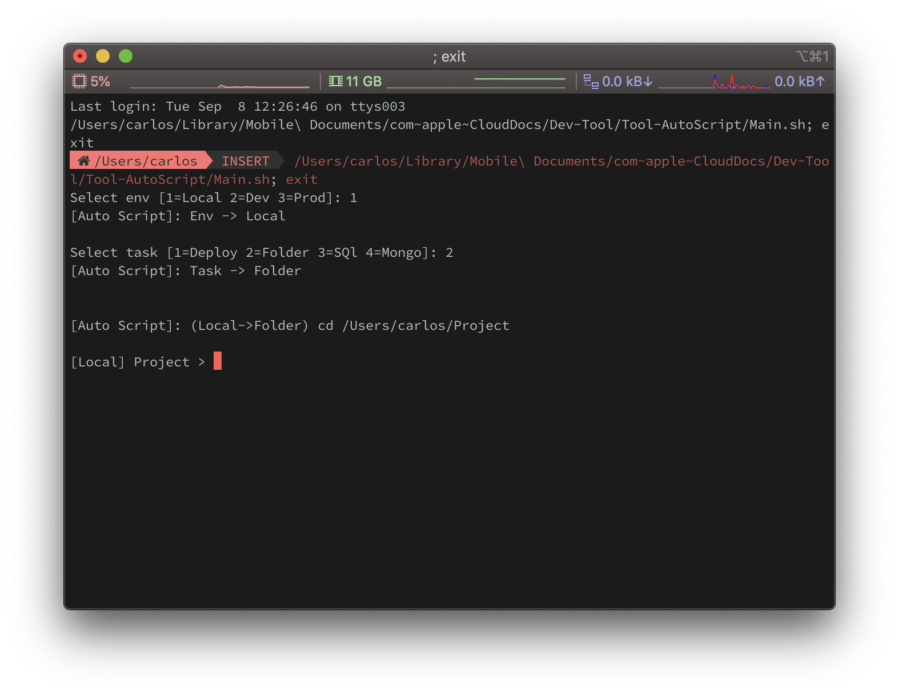

<!-- Title & Logo -->
<h1 align="center">Auto Script</h1>

<!-- tag & links (Version\Lang\Package) -->

    

## Overview
紀錄開發連線相關設定，使用簡易指令快速連線及部署。

## Feature
* ssh: 測試/正式環境
* 腳本模式: 快速部署/網站資料夾/資料庫

## 常用指令
* Git: 查看目前版本
* Server: 編輯env/清除快取/重啟伺服器
* laravel: 建立資料表/重啟隊列
